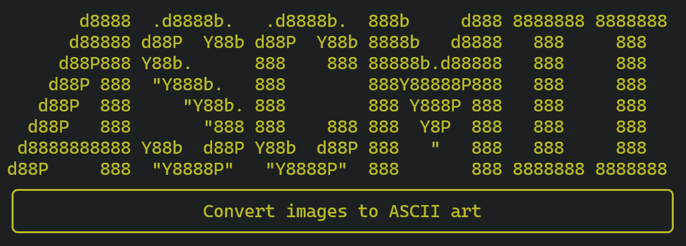

ASCMII is a Python command-line tool that converts images into ASCII art. It provides a simple and efficient way to transform images into text-based representations, suitable for various applications like terminal displays, text-based games, or artistic projects.

This project is based on the ascmii_magic package, which can be found here: [https://github.com/LeandroBarone/python-ascii_magic](https://github.com/LeandroBarone/python-ascii_magic).**

## Features

* **Image to ASCII Conversion:** Converts images to ASCII art using customizable character sets.
* **Customizable Character Density:** Adjust the level of detail in the ASCII output.
* **Color Support (Terminal):** Supports color output for terminals that support ANSI color codes.
* **Image Resizing:** Allows resizing images before conversion.

## Installation (From Source)

It's highly recommended to create a virtual environment to isolate the project dependencies.

1.  **Clone the Repository (Using Git):**

    Open your terminal or command prompt and navigate to the directory where you want to clone the repository. Then, run the following command:

    ```bash
    git clone https://github.com/michealcoleyoung/ascmii.git
    ```

2.  **Navigate to the Repository Directory:**

    Use the `cd` command to navigate to the `ascmii` directory:

    ```bash
    cd ascmii
    ```

3.  **Create a Virtual Environment (venv):**

    Create a virtual environment named `venv`:

    ```bash
    python -m venv venv
    ```

    or

    ```bash
    python3 -m venv venv
    ```

4.  **Activate the Virtual Environment:**

    * **On macOS and Linux:**

        ```bash
        source venv/bin/activate
        ```

    * **On Windows:**

        ```bash
        venv\Scripts\activate
        ```

5.  **Install Dependencies:**

    Install the required dependencies using `pip`:

    ```bash
    pip install -r requirements.txt
    ```

    or

    ```bash
    pip3 install -r requirements.txt
    ```

## Usage

* `python ascmii.py image.png` - Converts the specified image to ASCII art using default settings.
* `python ascmii.py image.png --columns 80` - Converts the image to ASCII art with 80 characters per row.
* `python ascmii.py image.png --width 3.0` - Converts the image to ASCII art, adjusting the output width to 3.0.
* `python ascmii.py image.png --monochrome` - Converts the image to grayscale ASCII art.
* `python ascmii.py image.png --char "#"` - Converts the image to ASCII art using the '#' character.
* `python ascmii.py image.png --front=RED` - Converts the image to ASCII art with a red foreground color.
* `python ascmii.py image.png --back=GREEN` - Converts the image to ASCII art with a green background color.

## License

Copyright (c) 2025 Cole Young.

This project is licensed under the MIT License - see the LICENSE file for details.
